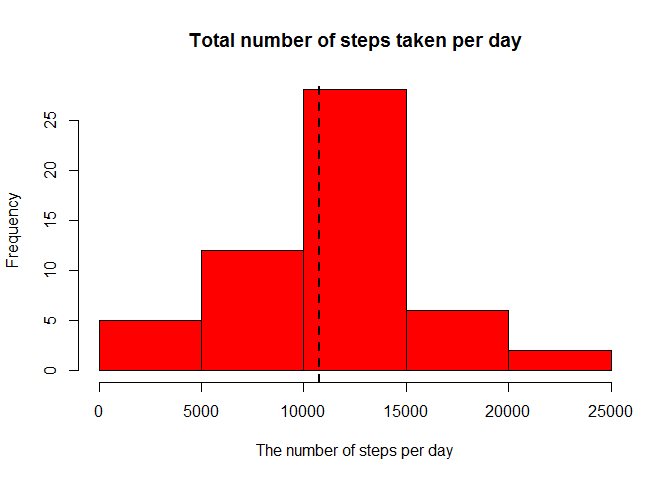
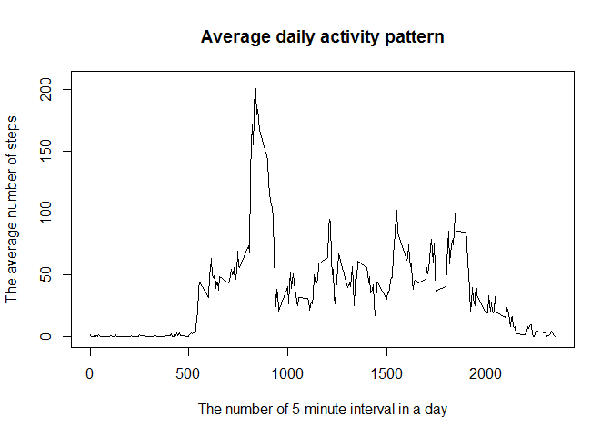
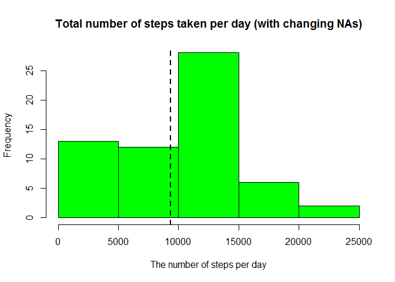
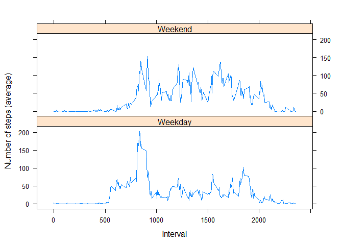

# Reproducible Research: Peer Assessment 1


## Loading and preprocessing the data
I assume that we are already in the working directory with the downloaded file.


```r
#specifing data settings for the USA format
Sys.setlocale("LC_TIME", "C")
```

```
## [1] "C"
```

```r
ds <- read.csv("activity.csv", header = T, na.strings = "NA", stringsAsFactors = F)
```

## What is mean total number of steps taken per day?
Let's calculate the total number of steps taken per day and then get the mean and the median.
The results can be verified based on the histogram and the abline (mean value).


```r
grouped_steps <- tapply(ds$steps, ds$date, sum)
mean_steps <- round(mean(grouped_steps, na.rm = T))
median_steps <- median(grouped_steps, na.rm = T)
hist(grouped_steps, col = "Red", main = "Total number of steps taken per day", xlab = "The number of steps per day")
abline(v = mean_steps, lwd = 2, lty = 2)
```

 

The mean is 1.0766\times 10^{4} and the median is 10765.

## What is the average daily activity pattern?
Let's calculate the average daily activity pattern - we need to group the number of steps per 5-minute interval and then get the number of the most active one.


```r
grouped_steps2 <- tapply(ds$steps, ds$interval, mean, na.rm = T)
plot(names(grouped_steps2), grouped_steps2, type = "l", main = "Average daily activity pattern", ylab = "The average number of steps", xlab = "The number of 5-minute interval in a day")
```

 

```r
#Getting the number of maximum element
max_number <- names(grouped_steps2[grouped_steps2 == max(grouped_steps2)])
```

The number of 5-minute interval with the maximum average number of steps per day is 835.

## Imputing missing values


```r
mis_values <- sum(is.na(ds))
```
There are 2304 missing values in the data set.
I implemented a straight forward strategy to devise NAs (making them equal to 0) and created a new data set.

```r
temp_ds <- ds
temp_ds[is.na(temp_ds)] = 0
grouped_steps3 <- tapply(temp_ds$steps, temp_ds$date, sum)
mean_steps3 <- round(mean(grouped_steps3))
median_steps3 <- median(grouped_steps3)
hist(grouped_steps3, col = "Green", main = "Total number of steps taken per day (with changing NAs)", xlab = "The number of steps per day")
abline(v = mean_steps3, lwd = 2, lty = 2)
```

 

```r
mean_difference <- mean_steps-mean_steps3
median_difference <- median_steps-median_steps3
```

Therefore, the new mean is 9354 and the new median is 1.0395\times 10^{4}.
These values differ from the first ones: the new mean is lower by 1412, and the new median is lower by 370.
The impact is reasonable - now we have more periods when the user doesn't do anything and we don't ignore it (as in the first section). Hence, the average number of steps per day has decreased and we can see on the histogram that 0 steps are more frequent now.

## Are there differences in activity patterns between weekdays and weekends?

Let's find some differences in activity patterns for the new data set.

```r
#Getting a new column about weekdays into a new data set
temp_ds$date <- strptime(temp_ds$date, "%Y-%m-%d")
temp_ds$date <- as.POSIXct(temp_ds$date)
weekdayFactor <- weekdays(temp_ds$date)
weekdayFactor[!(weekdayFactor %in% c('Saturday', 'Sunday'))] = 'Weekday'
weekdayFactor[weekdayFactor %in% c('Saturday', 'Sunday')] = 'Weekend'
temp_ds <- cbind(temp_ds, weekdayFactor)
#Constructing the final data set for plotting
first_ds <- temp_ds[temp_ds$weekdayFactor == 'Weekday',]
second_ds <- temp_ds[temp_ds$weekdayFactor == 'Weekend',]
grouped_steps41 <- tapply(first_ds$steps, first_ds$interval, mean)
grouped_steps42 <- tapply(second_ds$steps, second_ds$interval, mean)
temp1 <- cbind(names(grouped_steps41), grouped_steps41, 'Weekday')
temp2 <- cbind(names(grouped_steps42), grouped_steps42, 'Weekend')        
final_ds <- rbind(temp1, temp2)
final_ds <- as.data.frame(final_ds, stringsAsFactors = F)
final_ds[,1] <- as.numeric(final_ds[,1])
final_ds[,2] <- as.numeric(final_ds[,2])
final_ds[,3] <- factor(final_ds[,3], labels = c("Weekday", "Weekend"))
library(lattice)

xyplot(final_ds[,2] ~ final_ds[,1] | final_ds[,3], layout = c(1, 2), type = "l", xlab = "Interval", ylab = "Number of steps (average)")
```

 

The plot is sensible - during a weekend the person moves not to much but all day long. On the other hand, for a weekday - the person wakes up earlier, goes to work and doesn't move to much.
